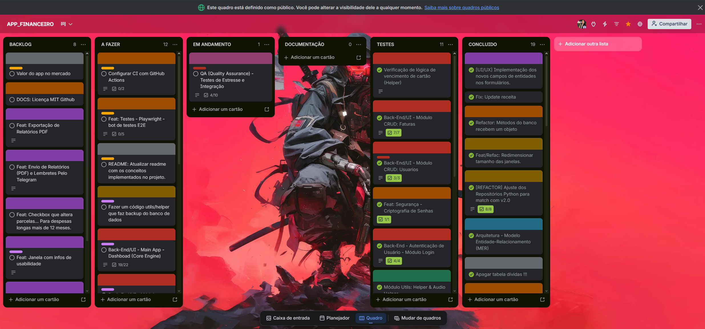
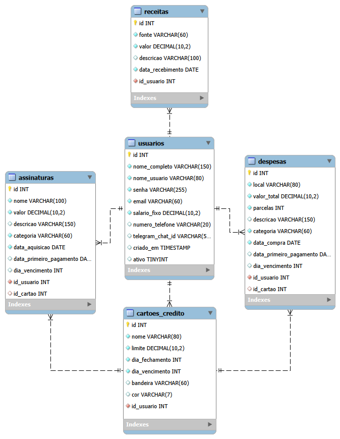
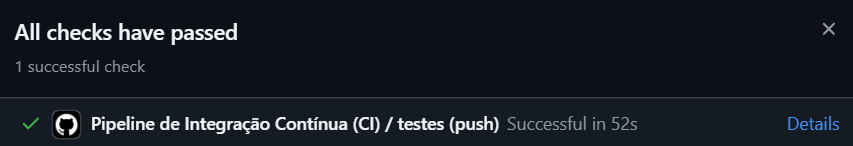

## 💰 MVP APP_FINANCEIRO | Gestão de Fluxo de Caixa Desktop


---

<!--🧱 Stack Tecnológico do Projeto-->


  

<!-- Status do projeto-->


---
<div align="center">
  <!-- Puxando o gif direto do repositório local -->
  
</div>

`💡Dentro do repositório do projeto (DOCS), tem as imagens de cada setor para visualização detalhada💡`

---

Este projeto nasceu para solucionar uma das dores mais latentes da sociedade moderna: a gestão, o controle e a projeção financeira confiável. Mais do que um gerenciador, desenvolvi um **ecossistema comercialmente resiliente para análise de capacidade de fluxo de caixa**, projetado sob os pilares estritos de **Programação Orientada a Objetos (POO) Avançada**, **Arquitetura Limpa** e **Integridade Relacional de Dados**. O sistema mitiga falhas humanas e imprecisões matemáticas catastróficas comuns em planilhas tradicionais.

---

## 📇​​ Gerenciamento Ágil (Kanban Rastreável) & Git Flow

O ciclo de vida do projeto foi orquestrado utilizando a metodologia Kanban via **Trello**, com controle estrito de escopo por branches e validação contínua via Pull Requests.Cada funcionalidade, refatoração de banco ou implementação de teste foi mapeada/manipulada para garantir previsibilidade, foco em valor incremental e eliminação de desperdícios (débito técnico).

<div align="center">
  <!-- Puxando o PNG direto do repositório local -->
  
</div>

---

## 🏗️ Arquitetura Padrão Ouro & POO Avançada

Organização impecável dividida em camadas desacopladas (models, utils, ui, tests). Aplicação estrita de Orientação a Objetos (POO), herança, encapsulamento, inversão de dependência e forte tipagem estática, garantindo manutenibilidade e fácil expansão do sistema.

---

## 🏛️ Modelagem Relacional & Arquitetura de Banco (DER)

Concepção e design completo da infraestrutura de dados de ponta a ponta. Projetei o Diagrama de Entidade-Relacionamento (DER) do zero, estruturando tabelas normalizadas, relacionamentos complexos (1:N), chaves primárias/estrangeiras e constraints de integridade para garantir performance e consistência transacional no MySQL.

<div align="center">
  <!-- Puxando o PNG direto do repositório local -->
  
</div>

---

## 🔐 Segurança & Criptografia (Bcrypt)
Camada de segurança por criptografia de via única (Hashing) utilizando Bcrypt com fator de custo configurado em 12 rounds. O repositório executa uma migração em tempo de execução: senhas legadas em texto limpo são validadas diretamente e, no primeiro login bem-sucedido, o sistema gera o hash automaticamente e sobrescreve o registro antigo no banco de dados de forma transparente.

---

## 📅 Lógica Contábil & Manipulação de Datas

Domínio completo de regras de negócio financeiras complexas. Desenvolvimento de algoritmos para controle estrito de ciclos de faturamento de cartões de crédito, tratando de forma manual e segura o fluxo de parcelamentos através de manipulação avançada de strings e objetos de data (datetime).

---

## ⚙️ Motor de Simulação & Mocks Temporais Avançados

Sandbox de Projeção Financeira (Simulação Volátil em Memória): O ecossistema introduz uma funcionalidade avançada de simulação preditiva integrada aos formulários nativos de despesas e cartões de crédito. O usuário pode simular o impacto de novas compras parceladas ou recorrentes para o mês vigente e para os próximos 5 meses... eliminando completamente a poluição do banco de dados de produção.

---

## 🧪 Engenharia de QA (Quality Assurance) & Esteira CI/CD (GitHub Actions)
A confiabilidade, portabilidade e estabilidade do ecossistema são garantidas por uma estratégia moderna de QA (Quality Assurance). O projeto combina validações manuais (Testes Caixa Preta (Funcionais)) e uma suíte de 23 testes automatizados (Unitários + Integração) integrados a um pipeline de nuvem que homologa cada modificação no código em menos de 1 minuto.

<div align="center">
  <!-- Puxando o PNG direto do repositório local -->
  
</div>

---

## 🚀 Outros Diferenciais de Engenharia de Software

Além da robustez arquitetural, o app_financeiro foi projetado sob os pilares de UI/UX Inteligente e Soberania do Usuário. Cada componente de interface e inteligência analítica foi lapidado para entregar uma experiência fluida, previsível, interativa e visualmente rica. 

`💡Clique/Toque nos blocos abaixo para expandir os detalhes técnicos:💡`
<details>
  <summary><b>📒​Data Access Layer (DAL)</b></summary>
  <p>Camada de persistência isolada em `repositorios.py`, utilizando **Row Mappers** para converter resultados SQL em dicionários Python.</p>
</details>

<details>
  <summary><b>🎛️ Padrão Mediator (Orquestração de Interface)</b></summary>
  <p>Centralização da lógica de comunicação entre frames via `crud_app.py` (Pattern Facade) e controle de ciclo de vida mestre sem estouro de pilha na *Super Main*.</p>
</details>

<details>
  <summary><b>🔄 Sanitização Proativa & Hot-Reload</b></summary>
  <p>Validação de inputs em tempo real via **Regex** no Front-end para evitar TypeErrors e atualização inteligente da interface (método `att_app`) sem reinicializar a aplicação.</p>
</details>

<details>
  <summary><b>🧮 Algoritmo de Distribuição Residual</b></summary>
  <p>Para evitar a perda invisível de centavos em dízimas de parcelamentos (ex: R$ 100,00 divididos em 3x gerando R$ 99,99), o sistema utiliza a biblioteca Decimal com quantize, interceptando a sobra matemática e injetando-a automaticamente na última parcela do vetor:$$\text{Vetor de Parcelas: } [33.33, \; 33.33, \; 33.34] \implies \text{Total Cravado: } R\$ \, 100,00$$</p>
</details>

<details>
  <summary><b>🗺️ Motor Temporal Dinâmico e Geolocalização de Feriados</b></summary>
  <p>A engenharia de vencimentos realiza uma leitura nativa da localização do Windows do usuário, injetando o estado federativo dinamicamente na biblioteca holidays. Se uma fatura vence em um feriado regional (ex: 9 de Julho em SP) ou final de semana, o motor recalcula e empurra o fluxo automaticamente para o próximo dia útil, eliminando projeções falsas de juros.</p>
</details>

<details>
  <summary><b>🔊 Feedback Sonoro Responsivo (UI/UX)</b></summary>
  <p>Implementação de estímulos sensoriais de interface utilizando a biblioteca <strong>Pygame</strong> para emitir alertas sonoros discretos em tempo de execução. O motor atua como um validador de ações, notificando o usuário auditivamente sobre o sucesso de transações ou ocorrência de erros, entregando uma experiência de uso fluida, interativa e com sensação de acabamento premium.</p>
</details>

<details>
  <summary><b>📊 Inteligência Analítica & Visão de Caixa (UI/UX)</b></summary>
  <p>Integração da biblioteca <strong>Matplotlib</strong> para processar dados de despesas e renderizar um gráfico de pizza dinâmico diretamente na interface gráfica. O sistema traduz registros brutos do banco de dados em insights visuais imediatos, calculando a distribuição percentual das categorias para que o usuário tenha total clareza e previsibilidade sobre o destino do seu capital.</p>
</details>

---

## 🛠️ Tecnologias, Ecossistema e Bibliotecas Chave

Para construir este ecossistema estável, performático e desacoplado, foram selecionadas a dedo tecnologias que cobrem desde a fundação dos dados até a esteira de entrega contínua:

#### 🧠 **Core & Linguagem**
*   **Gestão Ágil:** Kanban via Trello (Documentado em `/DOCS` [Quadro Trello](https://trello.com/b/PaYLzi3t/appfinanceiro)).
* **Ideação e Arquitetura:** Colaboração técnica via Gemini AI (Google). (Consultas, organização, correção, debug)
*   **Python 3.x** — Motor principal do ecossistema, aplicando POO avançada e tipagem.

#### 🏛️ **Persistência & Engenharia de Dados**
*   **MySQL / Connector** — Banco de dados relacional robusto com integridade referencial via Constraints.

#### 🔐 **Segurança & Criptografia**
*   **Bcrypt** — Algoritmo de hashing assimétrico de alta segurança utilizado para a proteção de credenciais, implementando salting robusto contra ataques de dicionário e brute-force.

#### 🖼️ **UI/UX Sensorial & Inteligência Analítica**
*   **GUI:** [CustomTkinter](https://github.com/TomSchimansky/CustomTkinter) (Visual Dark Mode moderno).
*   **Matplotlib** — Biblioteca de visualização para geração e plotagem dinâmica dos gráficos de saúde financeira.
*   **Pygame** — Motor de áudio não-bloqueante via Threads para feedbacks sensoriais do usuário.

#### 🧪 **Engenharia de QA & Qualidade de Código**
*   **Unittest** — Framework nativo do Python para a arquitetura e execução de testes unitários automatizados, garantindo a integridade das regras de negócio a cada alteração.
*   **Coverage** — Ferramenta analítica de cobertura de testes que mapeia com precisão quais linhas do código fonte foram executadas durante a validação de QA, assegurando a confiabilidade da esteira de CI/CD.

> 📝 **Nota de Engenharia:** Para fins de documentação limpa, apenas as bibliotecas estruturais e de arquitetura foram listadas acima. Todas as dependências secundárias, pacotes utilitários e sub-bibliotecas exatas estão rigorosamente mapeados e congelados no arquivo [`requirements.txt`](./requirements.txt).
---

## 📁 Arquitetura do Projeto

```text
APP_FINANCEIRO/
├── .github/workflows/   # Pipeline de Integração Contínua (GitHub Actions)
├── assets/              # Recursos de mídia e feedbacks sonoros (Pygame)
├── avir_af/             # Ambiente Virtual Python (Virtual Environment isolado)
├── docs/                # Documentações do projeto, scripts MySQL, prints temporais - Quadros KAMBAM e MER v2.0
├── htmlcov/             # Relatórios analíticos de cobertura de testes em HTML
├── models/              # Camada de Domínio (Entidades, Repositórios e DTOs e POO)
├── tests/               # Suíte de Testes Automatizados (Unitários e Integração)
├── ui/                  # View Layer (Telas CustomTkinter, Modais e Frames)
├── utils/               # Motores Contábeis, RegEx, Mocks e Auxiliares de Áudio
├── .coverage            # Dados brutos de cobertura gerados pelo Coverage.py
├── .gitignore           # Bloqueio de subida de binários, venv e arquivos com credenciais
├── config.ini           # Arquivo de configuração e credenciais de Produção (Local)
├── example_config.ini   # Template de exemplo para configuração do banco de produção
├── example_test_config.ini # Template de exemplo para configuração do banco de testes
├── main.py              # Bootstrapper (Orquestrador do Ciclo de Vida e Super Main)
├── README.md            # Manual de Engenharia e Documentação do Ecossistema
└── requirements.txt     # Manifesto de dependências e bibliotecas do ecossistema
```
---

## 🔧 Como Rodar o Projeto
Siga o passo a passo abaixo para levantar o ambiente virtual, instalar as dependências, criar a estrutura do banco de dados e rodar tanto a aplicação quanto a suíte de testes.

#### 1. Clonar o Repositório e Acessar o Diretório
Git clone:  [Link Para Repositório](https://github.com/BRUNOSR-DEV/app_financeiro.git)

#### 2. Ativar o Ambiente Virtual (venv)
O projeto utiliza um ambiente virtual isolado chamado avir_af. No Windows, ative-o executando:

Bash:  `.\avir_af\Scripts\activate`
(Nota: Certifique-se de que o prompt do seu terminal agora exibe (avir_af) no início da linha).

#### 3. Instalar as Dependências do Ecossistema
Bash: `pip install -r requirements.txt`

#### 4. Configurar a Infraestrutura do Banco de Dados (MySQL)
Certifique-se de que o seu servidor MySQL local (8.0+) está ativo e rodando.
Acesse o diretório DOCS/MER/ no seu projeto, onde está localizado o script SQL de criação das tabelas (.sql). execute o script no seu MySQL Workbench ou console para criar o esquema completo do banco v2.0 com a hierarquia correta de chaves estrangeiras.

#### 5. Configurar as Chaves e Credenciais (.ini)
O sistema gerencia os ambientes de produção local e laboratório de testes através de arquivos separados. Nunca comite seus dados reais.

Para Rodar o Aplicativo Principal: Duplique o arquivo example_config.ini, renomeie a cópia para config.ini e insira as credenciais do seu banco de dados de produção local.

Para Rodar a Suíte de Testes Automatizados: Duplique o arquivo example_test_config.ini, renomeie para test_config.ini e insira as credenciais do seu banco de dados dedicado aos testes.

#### 6. Executar a Suíte de Testes Locais
Para garantir que o motor de negócios e a camada de persistência estão 100% íntegros antes de subir a interface, execute os 23 testes automatizados via terminal:

Bash: `python -m unittest discover -s tests`

#### 7. Inicializar o Aplicativo
Com os testes aprovados e as credenciais do config.ini prontas, dê o start no bootstrapper mestre para abrir a interface gráfica do CustomTkinter:

Bash: `python main.py`

